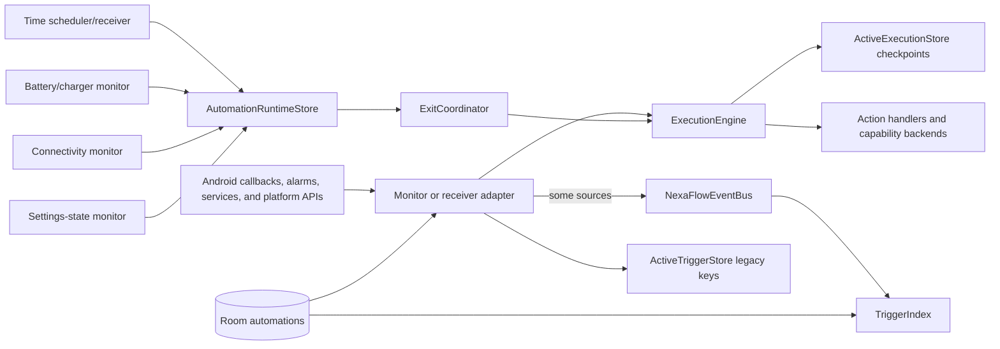

# NexaFlow Automation Engine Audit — 2026

**Author:** Manus AI

**Audit baseline:** `v3.48.0` / `7a7183c096f176c51e81edb81b4620fd9ea1f01d`
**Status:** In progress; this record is updated only from inspected implementation paths and verified platform references.

## 1. Architecture map

NexaFlow keeps Android platform adapters in `core:automation-engine`, command/action dispatch in `core:execution`, immutable workflow models and validation in `domain`, and Room-backed persistence mappings in `data`/`core:database`. The `MonitoringService` is the production host for monitor registration and starts the repository-backed `TriggerIndex` after its initial recovery work.

> **Current architectural boundary:** the new occurrence-aware runtime lifecycle protects time ranges, connectivity, and battery/charger paths. It is not yet the common ownership model for every stateful monitor.

| Layer | Actual responsibilities observed | Reliability boundary |
|---|---|---|
| `domain` | Immutable `Automation`, `Trigger`, `Action`, `Constraint`; `TriggerType`, `ActionType`, structural workflow validation | No Android imports in evaluated domain models; structural validation presently does not validate most type-specific trigger/action semantics. |
| `data` / `core:database` | Room persistence and repository CRUD for automation definitions | Save, disable, and delete are direct data mutations; no engine-level exit policy is invoked at this boundary. |
| `core:automation-engine` | Alarm delivery, foreground monitoring service, platform monitors, event ingress | Time, battery/charger, connectivity, and settings-state use the occurrence lifecycle; several other monitor families still own local activation/exit maps and invoke `runExit` directly. |
| `core:execution` | Action dispatch, capability preflight, durable action checkpoints, action history, device-state snapshots | The new runtime lifecycle is injected here for stateful admission and recovered exits. |
| `core:datastore` | Durable legacy trigger keys, execution checkpoints, runtime occurrence and schedule ledger | The runtime store is bounded and atomic per DataStore transaction, but currently records one lifecycle per automation. |

## 2. Authoritative trigger catalog

The source of truth is `TriggerType`, not the README. The enum contains **52** actual trigger types. The builder declares editors for this catalog, while `TriggerSource.forTrigger` maps it to the following platform-source families.

| Source family | Trigger types currently mapped |
|---|---|
| Time | `TIME` |
| Battery | `BATTERY`, `CHARGER`, `BATTERY_TEMPERATURE` |
| Application | `APPLICATION`, `APP_INSTALLED` |
| Device | `DEVICE`, `ROM_SETTING`, `HEADPHONE`, `AIRPLANE_MODE`, `DARK_MODE`, `CALL_STATE`, `MEDIA_PLAYING`, `VOLUME_CHANGED`, `POWER_SAVER`, `BLUETOOTH_STATE`, `BRIGHTNESS_LEVEL`, `STORAGE_LOW`, `AUTO_ROTATE`, `DATA_SAVER_STATE`, `DEVICE_LOCKED`, `WIFI_STATE`, `NFC_STATE`, `LOCATION_STATE`, `SCREEN_ROTATION_STATE`, `USB_CONNECTED`, `HDMI_CONNECTED`, `CLIPBOARD_CHANGED`, `DND_STATE`, `STAY_AWAKE_STATE`, `AUTO_BRIGHTNESS_STATE`, `SCREEN_TIMEOUT_CHANGED`, `TIMEZONE_CHANGED`, `BOOT_COMPLETED`, `NFC_TAG_SCANNED`, `ALARM_SET_CHANGED` |
| Connectivity / telephony | `CONNECTIVITY`, `NETWORK_MODE`, `WIFI_SIGNAL_STRENGTH`, `CELL_SIGNAL_STRENGTH`, `ETHERNET_CONNECTED`, `VPN_CONNECTED`, `DATA_ROAMING_STATE` |
| Location | `LOCATION` |
| Bluetooth | `BLUETOOTH_DEVICE` |
| Ringer | `RINGER_MODE` |
| Notification | `NOTIFICATION` |
| Calendar | `CALENDAR` |
| Sensor | `SENSOR` |
| SMS | `SMS` |
| Webhook | `WEBHOOK` |
| Explicit approved plugin | `PLUGIN_EVENT` |

## 3. Trigger and state semantics found

`Automation.constraints` have explicit **AND** semantics: every configured constraint must evaluate true before actions run. This is a gate on execution, not a general trigger-composition algebra. In contrast, existing monitors commonly select the first matching trigger of their family; the code does not implement nested trigger groups or a durable multi-trigger AND/OR occurrence state.

Momentary triggers are identified by `Automation.completesExitOnFinish`: non-range `TIME`, `SMS`, `WEBHOOK`, `APP_INSTALLED`, `CLIPBOARD_CHANGED`, `TIMEZONE_CHANGED`, `BOOT_COMPLETED`, `NFC_TAG_SCANNED`, `ALARM_SET_CHANGED`, and `PLUGIN_EVENT`. This prevents an omitted completion policy from stranding a custom exit for an event with no opposite state. Other families are generally treated as level/state transitions, but their state persistence varies.

| Trigger lifecycle class | Current concrete behavior | Audit result |
|---|---|---|
| `TIME` range | Durable schedule occurrence plus occurrence/generation/window validation; end is routed through `ExitCoordinator` | Hardened in v3.48.0. |
| Connectivity and battery/charger | Stateful occurrence admission through `AutomationRuntimeStore`; known false ends through `ExitCoordinator`; unknown reads are intentionally not exits | Hardened in v3.48.0. |
| Settings state (`POWER_SAVER`, radio/settings, storage, lock, location switch, screen rotation) | Tri-state platform reads, occurrence admission through `AutomationRuntimeStore`, and confirmed-state exit via `ExitCoordinator` | Hardened in this change; an `UNKNOWN` read retains ownership. |
| Location, Bluetooth device, ringer, media, notification, sensor, ROM setting, and other legacy level monitors | In-memory map plus `ActiveTriggerStore` key; most clear local/durable state before direct `runExit` | Not occurrence-aware; direct exits remain and are not represented as hardened by this release. |
| One-shot event sources | Trigger action execution with cooldown/local de-duplication appropriate to the adapter | Must be audited individually for receiver lifetime and idempotency keys. |

## 4. Key architecture findings before implementation

| ID | Finding | Evidence in inspected code | Severity | Direction selected for further audit |
|---|---|---|---|---|
| AE-01 | Stateful exit coordination is partial, not universal. | `AutomationRuntimeStore` appears only in scheduler, connectivity, battery/charger, and `ExitCoordinator`; direct exits remain in 17 monitor classes. | High | Introduce reusable, source-scoped lifecycle admission/exit handling only where source semantics can be verified; avoid a blind mass rewrite. |
| AE-02 | Some monitor reads collapse unreadable platform state into `false`. | `SettingsStateMonitor.evaluateAll` uses `runCatching { isSatisfied(...) }.getOrDefault(false)`. | High | Formalize tri-state evaluation and ensure `UNKNOWN` never ends an active occurrence. |
| AE-03 | Legacy active keys expire by age. | `ActiveTriggerStore.activeKeys` filters stamped keys older than seven days; boot invokes `purgeExpired()` before monitor re-arm. | High | Audit whether expiry is safe for each source and ensure no valid cleanup is hidden before runtime reconciliation. |
| AE-04 | Editing, disabling, and deleting are repository mutations without a lifecycle policy. | `AutomationRepositoryImpl` directly inserts, deletes, or changes enabled state in Room. | High | Design an engine-facing mutation coordinator without reversing module boundaries or deleting cleanup evidence. |
| AE-05 | Workflow validation is structural only. | `WorkflowValidator` checks bounds and dependency structure but not time range, semantic config, capability, or exit/revert exclusivity. | Medium | Add safe, typed, domain-only semantic validation where configuration can be checked without platform assumptions. |
| AE-06 | The trigger index is a valuable immutable, atomic projection but is not the universal event pipeline. | `TriggerIndex` publishes complete volatile immutable snapshots; many monitors still query repositories and own state separately. | Medium | Reuse the index where safe; do not claim a fully centralized event state machine until source adapters are migrated. |

## 5. Initial acceptance policy

The implementation will prioritize **durable safety over speculative automation**. In particular, it will not reinterpret an unreadable platform state as false, it will not erase active evidence merely because a legacy timestamp aged out, and it will not claim universal OEM delivery. Any migration of a legacy source will be source-scoped, occurrence-aware, and covered with deterministic unit tests before it is released.

The audit will continue with execution and exit behavior, time/alarm receiver behavior, connectivity/telephony/platform capability behavior, action/revert ownership, and an independent final gap pass. The final release report will distinguish implemented coverage from remaining platform and monitor limitations.

## 6. Execution, exit, and recovery audit

`ExecutionEngine` assigns a UUID `runId` through `WorkflowRunContext`, opens an `ActiveExecutionStore` checkpoint before action-side effects, and assigns an idempotency key per action index. Main actions run **sequentially** in list order. Handler errors are converted into `SystemControlResult.fail`, so subsequent actions currently continue; the resulting `ExecutionRecord.success` is false when any action result fails. This is a deliberate observable partial-execution semantic in code, but it is not yet exposed as a product-level rollback policy.

`ExitCoordinator` implements an atomic `ACTIVE → EXITING` claim for a matching durable occurrence. A successful exit removes the runtime occurrence; an unsuccessful exit moves it to `EXIT_FAILED` and allows at most one automatic recovery attempt. This is the authoritative exit path for range time, connectivity, and battery/charger sources. `ExecutionEngine.runExit` still consumes its legacy active-execution marker before performing actions, so direct legacy monitor callers lack the occurrence ledger that preserves failure recovery.

| ID | Finding | Evidence in inspected code | Severity | Required handling |
|---|---|---|---|---|
| AE-07 | The durable action checkpoint for a thrown/cancelled main action was marked unknown and then unconditionally removed in `finally`. | The old `finally` completed every checkpoint, including `ACTION_UNKNOWN`. | High | **Resolved in this change:** interrupted action classification is persisted in `NonCancellable`, the checkpoint is retained, and one-shot end actions are not run after an uncertain main action. Startup recovery claims it as `RECOVERY_REQUIRED` for verification/compensation. |
| AE-08 | Recovery is connected to application startup but is diagnostic rather than a workflow resumer. | `ExecutionRecoveryCoordinator` claims non-terminal checkpoints and writes `RECOVERY_REQUIRED`; it does not reload and replay definitions. | Medium | Keep uncertain side effects non-replayable; surface explicit recovery diagnostics and do not present the current classifier as automatic completion. |
| AE-09 | Manual condition gating was boolean-only. | Unreadable/non-evaluable sources could return `false`, after which `runWithConditionGate` invoked forced configured exit. | High | **Resolved conservatively in this change:** `evaluateAsync` returns `ConditionResult`; event-only and legacy ambiguous false reads are `UNKNOWN`, which creates an explicit skip record without end actions. Only a defined set of directly observable sources can produce a manual confirmed-false exit while remaining legacy probes are migrated. |
| AE-10 | Runtime lifecycle has no activation/ending phases, execution IDs, or workflow revision binding. | `AutomationRuntimeLifecycleState` currently has `ACTIVE`, `EXITING`, and `EXIT_FAILED`; `AutomationRuntimeState` does not retain execution id or configuration revision. | Medium | Extend only when a transition needs the data. Preserve existing stable fields and decode compatibility; do not perform a destructive migration. |
| AE-11 | Deleted automation cleanup remains unsafe by design in reconciliation. | `ExitCoordinator.reconcile` clears a durable state when the definition is absent because it cannot safely reconstruct exit actions. | High | Route delete/disable through a coordinator while the immutable definition still exists; preserve history and avoid a post-delete silent cleanup loss. |

### Recovery policy retained

Uncertain action side effects must **not** be replayed automatically. A post-crash action that had reached `ACTION_STARTED` or `ACTION_UNKNOWN` requires verification or compensation. The corrective work in this release will therefore preserve a durable `RECOVERY_REQUIRED` fact and diagnostics rather than guessing that an external action either succeeded or failed.

## 7. Next audit focus

The next audit phase will validate time/alarm semantics and every receiver lifetime against current Android guidance, then inspect connectivity/telephony capability backends and the action/revert ownership model. The implementation phase will prioritize AE-02, AE-03, AE-07, AE-09, and safe disable/delete coordination where dependencies permit.

## 8. Scheduler, clock, alarm, and receiver audit

The time scheduler uses wall-clock epoch milliseconds (`RTC_WAKEUP`) for user-selected local calendar times and calculates the next occurrence through `ZonedDateTime` in the system zone. This is appropriate for a schedule such as “08:00 local time” that should remain local through timezone and daylight-saving changes. The implementation keeps an immutable occurrence id plus a SHA-256 generation derived from the definition and window, persists it before arming the alarm, and validates start/end delivery before effects. It also rebuilds schedules after boot/package replacement, time and timezone changes, and exact-alarm permission changes.

Android confirms that alarms are cancelled at shutdown and must be rebuilt after boot; it further requires checking exact-alarm access and reacting to `ACTION_SCHEDULE_EXACT_ALARM_PERMISSION_STATE_CHANGED` because permission revocation cancels future exact alarms. Android also cautions that receivers should not start long-running work because the process can be killed after `onReceive()`; `goAsync()` extends the receiver lifetime only for bounded work.[1] [2] [3]

| ID | Finding | Evidence in inspected code | Severity | Required handling |
|---|---|---|---|---|
| AE-12 | Occurrence and generation validation is implemented for scheduled starts and ends. | `AutomationScheduler` persists `ScheduledAutomationOccurrence`; `AutomationAlarmReceiver` validates identity, generation, start and end before execution. | Strength | Preserve this model; test every stale/edit/reboot path rather than replacing it with delays. |
| AE-13 | Boot, package replacement, clock/zone, and exact-alarm changes cause reconciliation and rescheduling. | Manifest filters and `AutomationAlarmReceiver` recovery/reschedule entry points are present. | Strength | Confirm tests cover all registered actions and that reconciliation does not depend on a future event. |
| AE-14 | A late range start is skipped once the end has passed, but non-range time alarms have no explicit, recorded misfire tolerance. | Range `START` checks `windowEndAt`; one-shot starts run on delivery without a lateness policy. | Medium | Define an explicit, visible policy for one-shot scheduled misfires, with a named constant and diagnostics rather than accidental execution at arbitrary lateness. |
| AE-15 | Receiver-critical work includes full automation action execution inside a `goAsync()` coroutine. | `AutomationAlarmReceiver` obtains a 30-second wake lock then directly calls `ExecutionEngine`/`ExitCoordinator`. | High | Keep the receiver path bounded; document the timeout and ensure timeout/cancellation preserves durable state. Longer workflows require a durable system-scheduled continuation rather than assuming receiver execution is indefinite. |
| AE-16 | Schedule identity may be consumed at range END even when exit fails. | Receiver removes the end occurrence after coordinated exit; `EXIT_FAILED` remains in runtime state. | Medium | Valid only because failure state is durable and reconciliation is independent of the schedule identity; preserve that invariant in tests. |
| AE-17 | Legacy trigger expiry is wall-clock based, whereas cooldown and durations require monotonic time. | `ActiveTriggerStore` uses `System.currentTimeMillis()` stamps; many monitors use wall-clock cooldown maps. | High | Separate absolute calendar scheduling from elapsed-time cooldown/duration semantics; do not let clock edits create duplicate eligibility or hide valid lifecycle evidence. |

### Scheduled-trigger policy selected for implementation

The scheduler continues to use wall-clock time only for **calendar occurrence selection**. A delivered range start whose window already ended is skipped and recorded as a misfire-safe outcome. A one-shot occurrence will receive an explicit named late-delivery policy with a bounded tolerance and a history/timeline diagnostic; it will never be silently replayed as a new occurrence. All original alarm identities remain untrusted until matched against the durable ledger.

## References

[1]: https://developer.android.com/develop/background-work/services/alarms "Android Developers: Schedule alarms"
[2]: https://developer.android.com/about/versions/14/changes/schedule-exact-alarms "Android Developers: Schedule exact alarms are denied by default"
[3]: https://developer.android.com/develop/background-work/background-tasks/broadcasts "Android Developers: Broadcasts overview"

## 9. Connectivity, telephony, and capability audit

Android documents that `TelephonyManager` instances use the default subscription unless callers explicitly create one with `createForSubscriptionId(int)`. It also documents that telephony behavior is unreliable on devices without `FEATURE_TELEPHONY`. The connectivity guidance confirms that callback `NetworkCapabilities` payloads are the authoritative data after `onAvailable`; synchronous capability queries from callbacks are race-prone. A default network can carry multiple transports, such as a VPN over Wi-Fi/mobile, so default-route observation must not be treated as physical-radio state.[4] [5] [6]

The current implementation already reflects several of these constraints. `CellularNetworkReader` returns `null` for unreadable current RAT and never treats it as `AUTO`; the connectivity monitor consumes `onCapabilitiesChanged` payloads and distinguishes unknown transport from known disconnect; Network Mode capability discovery distinguishes `NO_TELEPHONY`, `NO_ACTIVE_SUBSCRIPTION`, and `UNREADABLE`; and `NetworkModeController` uses subscription-scoped managers, read-back verification, controlled Shizuku/root operations, then legacy fallbacks only where representable.

| ID | Finding | Evidence in inspected code | Severity | Required handling |
|---|---|---|---|---|
| AE-18 | Network Mode differentiates current RAT, configured USER mask, known effective USER∩CARRIER mask, selectable hardware/carrier mask, and requested profile. | `CellularNetworkReader`, `NetworkModeCapabilities`, `NetworkModeController`, and `NetworkModePolicy` use distinct models/fields. | Strength | Preserve the semantic separation and prohibit a trigger for current RAT from being silently interpreted as configured mode. |
| AE-19 | The main public telephony write route is unnecessarily gated to API 33+. | `NetworkModeController` only invokes `setAllowedNetworkTypesForReason` under `TIRAMISU`, despite the project compiling against current API and already guarding invocation/read-back. | Medium | Verify the platform method’s supported API level from the direct reference before lowering the guard; retain runtime failure-to-next-backend behavior. |
| AE-20 | Active-data subscription changes re-register the telephony callback but subscription insertion/removal is otherwise only observed on the next callback/read. | `ConnectivityMonitor` handles `ActiveDataSubscriptionIdListener`; capability snapshots enumerate current active subscriptions on demand. | Medium | Treat a missing/removed subscription as explicit unreadable/unavailable state and avoid auto-restoration to a substituted SIM; document user reconfiguration requirements. |
| AE-21 | Hotspot reads collapsed a settings read failure to `OFF`. | `ConnectivityMonitor.currentNetworkValue` used `runCatching(...).getOrDefault(false)` for `tether_on`. | High | **Resolved in this change:** an unreadable `tether_on` now returns `null`/unknown, which follows the existing connectivity lifecycle rule of retaining active ownership. |
| AE-22 | Permission/capability state is centralized but runtime permission changes are not event-driven except for Shizuku and explicit UI refresh. | `CapabilityStateStore` invalidates from Shizuku state and serializes explicit refreshes. | Medium | Capability-sensitive monitors/actions must return an observable unavailable outcome and refresh on app resume/permission callback; permission loss must not become a false trigger state. |

### References

[4]: https://developer.android.com/reference/android/telephony/TelephonyManager "Android Developers: TelephonyManager"
[5]: https://developer.android.com/develop/connectivity/network-ops/reading-network-state "Android Developers: Read network state"
[6]: https://developer.android.com/reference/android/net/ConnectivityManager.NetworkCallback "Android Developers: ConnectivityManager.NetworkCallback"

## 10. Location, Bluetooth, SMS, and state-trigger audit

The audit identifies three older stateful monitor families—location, Bluetooth device state, and consolidated settings state—that still write legacy active keys before main actions and clear them before direct exit execution. This contradicts the durable lifecycle contract already implemented for time ranges, connectivity, and battery. It also makes a process death or exit failure unrecoverable for these trigger sources. The direct behavior is not a benign compatibility implementation: it can lose ownership evidence before configured exit actions or original-state restoration have completed.

| ID | Finding | Evidence in inspected code | Severity | Required handling |
|---|---|---|---|---|
| AE-23 | Location triggers use only `ActiveTriggerStore`, mark active before execution, and clear state before direct exit. | `LocationMonitor.handleLocation`. | High | Move activation to an occurrence-aware durable lifecycle and route confirmed leave events through `ExitCoordinator`; absence of a new location fix remains UNKNOWN, not leave. |
| AE-24 | Bluetooth device triggers use the same pre-runtime direct-exit pattern. | `BluetoothMonitor.handleEvent` and legacy rearm logic. | High | Migrate device event ownership/exit to the durable coordinator; retain address as a source key and never infer disconnect from permission/name-read failure. |
| AE-25 | `SettingsStateMonitor` mapped evaluator errors and unavailable hardware to `false`. | The prior boolean evaluator used fallback false values for adapters, storage, and settings reads. | High | **Resolved in this change:** `SATISFIED`/`NOT_SATISFIED`/`UNKNOWN` evaluation keeps unreadable state distinct from OFF/false. Missing adapter/service, failed `Settings` read, and failed storage read do not end a lifecycle. |
| AE-26 | Settings triggers bypassed durable lifecycle and cleared legacy state before `runExit`. | The prior monitor used local maps plus `ActiveTriggerStore` and direct exits. | High | **Resolved for this source family:** main actions receive `AutomationLifecycleContext`; exit goes through `ExitCoordinator`; compatibility keys are mirrored only after durable admission and cleared only after `Executed`, `NotActive`, or stale confirmation. Existing keys are promoted on startup without fabricating a restore snapshot. |
| AE-27 | SMS receiver has no durable idempotency key and auto-reply errors are silently discarded. | `SmsReceiver` deduplicates only via in-memory static cooldown and catches reply failures. | Medium | Add a bounded, privacy-safe delivered-message fingerprint ledger or explicit duplicate policy, record reply failure as an action result, and keep receiver work bounded. |
| AE-28 | SMS consent path has an explicit one-shot re-arm, but may share a message with legacy SMS delivery. | `SmsConsentReceiver` and `SmsReceiver` both use in-memory `SmsTriggerMatcher.lastRunAt`. | Medium | Deduplicate across both entry points by one common ledger key; do not depend on a process-local cooldown map. |
| AE-29 | Permission UI rechecks on resume but monitor runtime does not subscribe to that recheck. | `PermissionManagerScreen` refreshes its UI independently; monitors gate ad hoc. | Medium | On a verified permission/configuration refresh, re-evaluate monitors without converting unavailable state into a false transition. |

The supported current platform cannot guarantee delivery of all background location, Bluetooth, SMS, carrier, or OEM broadcasts. The implementation must therefore retain durable evidence and show an explicit unavailable/recovery result, rather than claim universal background reliability.

## 11. Action, revert, ownership, and conflict audit

`ExecutionEngine` runs ordinary actions sequentially and persists a pre-action checkpoint. The full-device revert path previously called `DeviceStateSnapshot.restore()` as a `Unit` operation and always generated a successful `STATE_RESTORE` result, even where a platform setter was rejected or threw. This was corrected during this audit: restore now aggregates `SystemControlResult` values only for setting families changed by that automation and returns the actual outcome to `ExecutionEngine`. Consequently, `ExitCoordinator` can retain `EXIT_FAILED` instead of clearing an occurrence after a false success.

| ID | Finding | Evidence / outcome | Severity | Resolution or retained risk |
|---|---|---|---|---|
| AE-30 | Whole-snapshot restore could report success despite partial platform rejection. | `DeviceStateSnapshot.restore()` discarded all restore results and `ExecutionEngine` hard-coded a successful `STATE_RESTORE`. | Critical | **Resolved in this change:** aggregate `SystemControlResult` values for action families changed by the automation and propagate success/message into the exit record. |
| AE-31 | Per-action reverts report individual results, while whole snapshot restore previously differed. | `restoreSetting()` returns `SystemControlResult`; full restore did not. | High | **Resolved:** full restore now follows the same result contract. |
| AE-32 | Resource ownership is occurrence-scoped but not setting-scoped across independent automations. | Runtime ledger prevents a second lifecycle for the same automation id; snapshots are keyed by automation id. | High | Retained architecture risk. Do not claim that independent overlapping automations touching the same setting can safely restore in stack order. A future setting-ownership ledger requires explicit precedence/user-intervention policy and migration design. |
| AE-33 | `priority` exists on the automation model and task queue, but the audit found no demonstrated cross-automation setting-conflict policy. | Domain model/task queue references; no verified setting owner/precedence reconciliation. | Medium | Retain documented behavior: ordering is not ownership. Avoid using priority as implied permission to overwrite user or newer automation state. |
| AE-34 | Snapshot capture is deliberately nullable when an original value cannot be read. | Snapshot fields are nullable and unsupported capture is skipped. | Strength | Preserve fail-closed semantics: an unreadable original value must not be invented or restored. |

### Implementation decision

This release focuses on preventing hidden exit success and preserving a recoverable durable lifecycle when restoration is incomplete. It does **not** introduce a parallel global setting-ownership stack because such a feature needs a complete policy for concurrent automations, user overrides, stale owners, and migration; adding it partially would be less safe than reporting and retaining the current limitation.

## 12. Implemented reliability slice and evidence

The implementation is deliberately source-scoped. `SettingsStateMonitor` now has one serialized evaluator, a local tri-state model, startup rearm from `AutomationRuntimeStore`, bounded compatibility-key promotion, and `ExitCoordinator` exits. It does not claim to solve the corresponding lifecycle defects in `LocationMonitor`, `BluetoothMonitor`, `DeviceEventMonitor`, ringer/media/notification/sensor monitors, or the remaining direct-exit paths. `LocationAccess` received nullable read APIs solely to preserve the settings trigger's `UNKNOWN` semantics; the older location worker retains its established behavior.

| Implemented control | Concrete behavior | Regression evidence added |
|---|---|---|
| Interrupted action recovery | An action that throws or is cancelled after `ACTION_STARTED` is durably marked `ACTION_UNKNOWN`, retained, and classified as `RECOVERY_REQUIRED`; no one-shot exit follows an uncertain chain. | `ExecutionEngineRecoveryCheckpointTest` checks retain → verify/compensate classification → recovery-required transition. |
| Whole snapshot revert outcome | `STATE_RESTORE` carries the aggregated restore result and can make the exit record unsuccessful. Restore attempts only action families changed by the occurrence. | `ExecutionEngineExitBehaviorTest` injects a controlled restore failure and verifies the failed action/result message. |
| Manual `UNKNOWN` policy | Event-only and ambiguous legacy probes write an explicit safe skip record and do not dispatch configured end actions. | `ExecutionEngineExitBehaviorTest` verifies `APP_INSTALLED` manual execution does not invoke end actions. |
| Settings-state lifecycle | Confirmed true admits a durable occurrence before compatibility mirroring; confirmed false requests one coordinator exit; unknown retains it. | `SettingsStateMonitorLifecycleTest` covers unavailable NFC as `UNKNOWN` and confirmed Power Saver false as one coordinated exit. |
| Hotspot state read | Failed `tether_on` reads produce unknown/null instead of `OFF`. | No new isolated test seam exists in this slice; the repository's complete remote unit suite and static source review are the acceptance evidence. |

The automated Gradle acceptance for these tests has not yet been run locally by design. It will be performed exclusively by the repository's remote GitHub Actions workflow after the implementation commit is pushed. The remaining direct-exit monitor families, stale seven-day compatibility keys outside the migrated source, generic delete-before-exit behavior, one-shot alarm late-delivery policy, receiver-length constraints, elapsed-time cooldown migration, SMS ingress deduplication, and cross-automation setting ownership remain open risks and must not be inferred as resolved.
