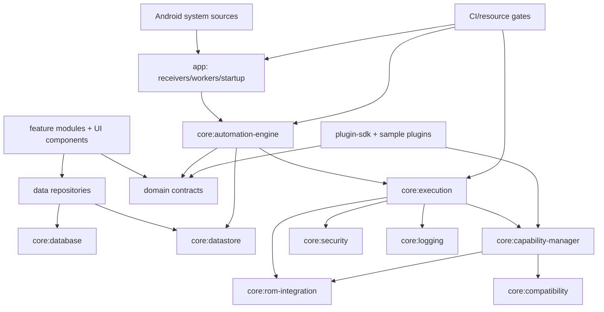
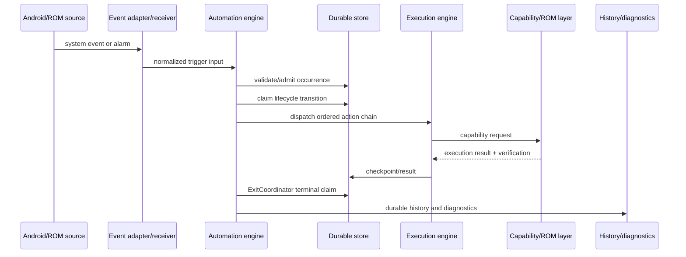
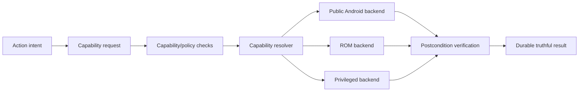

# NexaFlow Current Architecture — 2026

**Audit date:** 2026-09-01  
**Repository:** `Alaa91H/NexaFlow`  
**Evidence rule:** source code, build configuration, tests, CI definitions, and generated audit evidence are authoritative; prose documentation is corroborating evidence only.

## Executive assessment

NexaFlow is a modular Android automation runtime rather than a single feature module. The repository contains a domain model, persistence layer, durable scheduler/runtime, execution and capability layers, ROM integration, plugin SDK, Android application shell, feature UIs, and CI/resource gates. The recent hardening work established a strict occurrence lifecycle around `ExitCoordinator`, alarm admission, delayed time-range delivery, fixed-location transitions, and DNS read/write verification.

The architecture is **GREEN for the recently audited schedule/location/DNS paths**, **YELLOW for broader convergence toward a fully general durable workflow runtime**, and **GRAY for behavior that requires physical OEM/device validation**. No claim is made that every Android manufacturer, permission state, privileged backend, or process-death mode has been exercised on hardware.

## Module map

| Layer | Modules | Responsibility | Status |
|---|---|---|---|
| Application shell | `app` | Android entry points, workers, receivers, DI composition, navigation, runtime startup | GREEN/YELLOW |
| Domain | `domain` | Workflow/automation models, validation, scheduling concepts, retry and execution contracts | GREEN/YELLOW |
| Persistence | `core:database`, `core:datastore`, `data` | Room entities/DAOs, DataStore runtime state, repositories, paging and mappers | GREEN/YELLOW |
| Runtime | `core:automation-engine` | Trigger monitors, scheduler, lifecycle admission, occurrence delivery and recovery | GREEN for audited paths; YELLOW globally |
| Execution | `core:execution` | Action dispatch, system action handling, workflow execution and result classification | YELLOW |
| Capabilities | `core:capability-manager`, `core:rom-integration`, `core:compatibility` | Capability detection, ROM bridges, public Android APIs, privileged adapters and compatibility policy | YELLOW/GRAY by backend |
| Security/observability | `core:security`, `core:logging` | Safe command construction, privileged execution boundary, logging and diagnostics | YELLOW |
| Extensibility | `core:plugin-sdk`, `sample-plugins:nfc-toggle` | Plugin contracts, discovery, compatibility and sample implementation | YELLOW |
| Presentation | `core:ui-components`, `feature:*`, `feature:widgets` | Builder, dashboard, history, settings, themes, icons and widgets | YELLOW |
| Verification | `scripts`, `.github/workflows`, `macrobenchmark`, `baseline-profile`, test fixtures | Resource gates, static checks, CI, performance/profile scaffolding and locale fixtures | GREEN for configured gates; YELLOW for device depth |

## Dependency and boundary graph

The intended direction is from Android adapters and UI into contracts and repositories, then into the runtime and capability boundaries. Direct privileged operations are concentrated in ROM/security integration rather than exposed as workflow-level command strings. This direction is present but not yet uniformly enforced across every legacy action path; those paths remain YELLOW until architecture tests or explicit adapters prove the boundary.

## Runtime flow

## Trigger, schedule, and recovery flow

A schedule is calculated into a durable future occurrence. Alarm registration is treated as an admission transaction: the occurrence is not left armed if required platform registrations are rejected. Delivery validates automation identity, occurrence identity, generation, and window metadata before dispatch. Delayed valid time-range starts are still executed, while malformed ranges are rejected explicitly. Receiver-level failures may re-deliver the same logical occurrence within a bounded limit.

After process death or reboot, startup/recovery reads non-terminal runtime records, validates the checkpoint and lifecycle identity, restores retained ownership, and re-arms recoverable end occurrences. Location exits and other terminal transitions are routed through `ExitCoordinator`; a failed exit remains visible and recoverable instead of being cleared as success.

## Workflow and action flow

The builder persists automation definitions consumed by the domain validators and engine. The execution layer resolves action types and delegates system operations to `SystemController`, capability providers, ROM bridges, or public Android APIs. Action results are classified into success, failure, unknown, or unsupported outcomes according to the available postcondition evidence. The architecture already contains strict result handling in several paths, but a repository-wide durable `WorkflowExecution`/`NodeExecution` model with immutable workflow revisions is not yet proven by this audit and is therefore YELLOW.

## Capability and backend flow

DNS is the clearest current example. `DnsStateReader` inspects public network properties, `DnsProviderCatalog` discovers ROM-exposed hostnames and validated built-ins, and `SystemController.setPrivateDns` writes through the privileged settings path only when available and validates mode/hostname by read-back. Empty/null OEM representations are normalized for non-hostname modes in v3.53.1. Unsupported capabilities must remain explicit rather than being silently emulated.

## Persistence and consistency boundaries

Room-backed repositories own durable business records, DataStore owns runtime state where configured, and the automation engine owns lifecycle admission and completion semantics. Mappers separate storage entities from domain values. The principal remaining risk is not the existence of persistence but **cross-store atomicity and recovery evidence** when a side effect, checkpoint, and terminal transition span multiple components. Such cases require focused transaction/failure-injection tests before being marked GREEN.

## UI to runtime boundary

Feature modules configure triggers and actions through domain-facing drafts and validators. The UI must not directly execute shell, root, Shizuku, accessibility, or raw system operations. Configuration is passed to the runtime, where capability checks and postcondition verification decide the actual result. DNS provider chips are configuration-only; the execution layer remains authoritative for supported/unsupported outcome reporting.

## Security flow

Command construction is centralized through `SafeCommandBuilder`, and privileged execution is routed through `PrivilegedRunner`/ROM integration. Remaining audit work is to prove that every externally supplied package, hostname, setting name, plugin payload, and imported workflow reaches a validated contract before privileged execution or persistence. Secret non-persistence and redaction need explicit repository-wide evidence rather than inference from individual call sites.

## Status classification

| Classification | Meaning in this audit | Current examples |
|---|---|---|
| **GREEN** | Implemented and covered by source-level tests and successful CI evidence | Resource gates, DNS policy/catalog tests, alarm admission hardening, delayed range execution, fixed-location lifecycle routing |
| **YELLOW** | Implemented in part or covered unevenly; requires broader invariant/property/failure testing | General durable node execution, immutable workflow revisions, cross-store atomicity, universal capability contracts, plugin lifecycle, performance and memory budgets |
| **RED** | No evidence yet of a production-safe implementation for the stated target contract | A repository-wide claim of complete arbitrary workflow durability, universal backend support, or guaranteed execution across OEM policy denial |
| **GRAY** | Cannot be proven from static code/CI alone; requires a real device/OEM/permission matrix | Doze/reboot/process-kill behavior on each OEM, Private DNS ROM resource names, privileged runtime availability, accessibility and background restrictions |

## Current release evidence

The repository has published `v3.53.0` for DNS support and `v3.53.1` for the Private DNS read-back correction. The v3.53.1 tagged CI workflow passed lint and production build/release validation. The working tree was clean at the end of the audit step. These results prove the configured CI gates, not universal physical-device behavior.

## Next audit priorities

The next implementation tranche should prioritize one canonical durable execution state machine, explicit node-level idempotency/verification metadata, failure-injection coverage around checkpoint/side-effect boundaries, and architecture tests preventing direct privileged operations from domain/UI code. Each change must follow the repository contract → adapter → persistence → integration → test sequence and must preserve compatibility with existing plugin and automation APIs.
