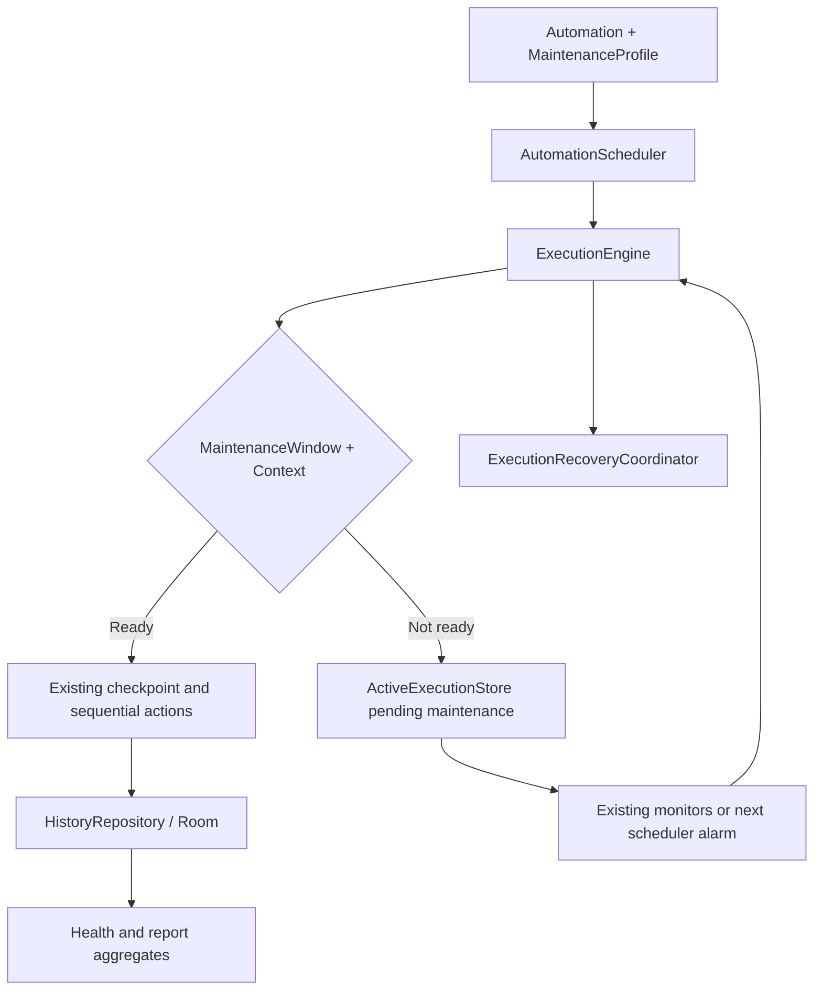

# تصميم الحد الأدنى لطبقة صيانة NexaFlow الإنتاجية

**الحالة:** تصميم قبل التنفيذ.  
**القاعدة:** لا Runtime جديد، ولا Scheduler أو Queue أو EventBus أو Persistence layer موازٍ.

## المبدأ

تظل `Automation` هي تعريف الوحدة القابلة للتشغيل. يصبح **MaintenanceProfile** بيانات typed اختيارية مرتبطة بها، لا كياناً تشغيلياً مستقلاً. وتظل `AutomationScheduler` مسؤولة عن الوقت، و`ExecutionEngine` عن بوابة الشروط والـcheckpoint والـside effects، و`ActiveExecutionStore` عن التشغيل المتين وحالات الانتظار، و`TaskManager` عن أعمال قصيرة داخل العملية فقط، وRoom عن history/aggregates.

## التغييرات البنيوية المحدودة

| التغيير | الموضع | سبب عدم اعتباره بنية موازية |
|---|---|---|
| `MaintenanceProfile` و`MaintenanceWindow` و`MaintenancePolicy` | domain داخل `Automation` | metadata typed لتعريف Automation القائم؛ لا Runtime مستقل. |
| حقل `maintenanceJson` مع migration صغيرة | `AutomationEntity` و`AutomationMapper` | توسيع جدول automations ومحوّله القائم، لا جدول تعريفات موازٍ. |
| `PendingMaintenanceRecord` | `ActiveExecutionStore`/نماذج DataStore القائمة | يمدد durable execution ledger الموجود لحفظ waiting/resume، لا يستخدم DB أو queue جديدين. |
| `MaintenanceReadinessEvaluator` | core/execution بجانب `AutomationConstraintGate` | بوابة pure/typed إضافية تعيد قراراً؛ لا محرك سياق دائم. |
| `MaintenanceDependencyPlanner` | domain بجانب `AutomationDagCompiler` | adapter يقود DAG compiler الموجود ويمنع cycles. |
| `HealthMetricsRepository` وqueries aggregate | HistoryRepository/ExecutionDao الحالية | قراءة وتجميع من history الحالي؛ لا event analytics store. |

## عقد البيانات المقترح

| النوع | الحقول الأساسية | السلوك |
|---|---|---|
| `MaintenanceProfile` | `kind`, `window`, `retryPolicy`, `notificationPolicy`, `dependsOnAutomationIds`, `recoveryPolicy` | metadata اختياري؛ Automation بلا profile تبقى متوافقة. |
| `MaintenanceKind` | `DAILY`, `WEEKLY`, `MONTHLY`, `MORNING`, `NIGHT`, `APP`, `STORAGE`, `AUTOMATION` | للتصنيف والقوالب فقط، لا منطق hard-coded. |
| `MaintenanceWindow` | start/end، allowedDays، minBattery، charging، unmetered Wi-Fi، screenOff، idle، maxThermalStatus، minStorageBytes | مطلب قبول typed؛ لا تجري side effect عند عدم تحققه. |
| `MaintenanceReadiness` | `READY`, `WAITING_FOR_WINDOW`, `WAITING_FOR_CONDITIONS`, `CAPABILITY_MISSING`, `INVALID_CONFIGURATION` | نتيجة قابلة للحفظ والعرض؛ ليست نجاحاً ولا failure نهائياً. |
| `PendingMaintenanceRecord` | automationId، scheduleOccurrenceId، idempotencyKey، readiness، reason، nextEligibleAt، attempts، created/updated | يمنع التكرار عند event/alarm/process restart. |
| `ExecutionFailure` | code، stage، reason، retryable، recoverable، attempt، timestamp | يضاف إلى history result بدلاً من رسالة نصية غير قابلة للتجميع. |

## تدفق النافذة والموارد

عند وصول alarm أو event، يحسب NexaFlow `scheduleOccurrenceId` من automation والتوقيت المحلي وwindow. يمر `ExecutionEngine` أولاً على `AutomationConstraintGate` ثم `MaintenanceReadinessEvaluator` قبل إنشاء checkpoint أو تشغيل أي action. إذا كانت النتيجة غير جاهزة وقابلة للانتظار، يحفظ `PendingMaintenanceRecord` بمعرف idempotency ثابت ويعرضها كـwaiting. عند تغيّر مورد ذي صلة، تستدعي المراقبات الموجودة إعادة تقييم pending records؛ وعند عدم وصول event، يعاد تقييمها عند المنبه التالي/نهاية النافذة. لا تستخدم هذه الآلية polling مستمراً.

إذا انتهت النافذة قبل تحقق القيود، تسجل المهمة `SKIPPED_WINDOW_EXPIRED` مع السبب، لا `FAILED`. إذا كان الخطأ غير قابل للانتظار مثل configuration غير صحيح أو capability غير موجودة، تسجل failure typed بلا إعادة محاولة.

## الجدولة

تستعمل القوالب اليومية والأسبوعية والشهرية `TriggerType.TIME` و`TimeTriggerCalculator` الموجودين. Daily = `DAILY`، Weekly = `SPECIFIC_DAYS`، Monthly = `MONTHLY` أو `MONTHLY_WEEKDAY`. لا تستخدم `PeriodicWorkRequest` بديلاً عن موعد محلي دقيق؛ وثائق Android تصف periodic work كفترة دنيا يتغير توقيتها بقيود وتحسينات النظام.[1]

تستخدم مهمة WorkManager القائمة، إن لزم، فقط كعمل تحقق/clean-up مؤجل idempotent لا يحتاج توقيت جدار دقيق. تظل alarm/reboot/timezone path الحالية نقطة الاستعادة الوحيدة للـTIME triggers.

## الاعتماديات والتعافي

تتحول `dependsOnAutomationIds` إلى nodes/edges عبر `AutomationDagCompiler` الموجود. أي cycle أو target مفقود يرفض في validator قبل الحفظ. لا تشغّل dependency تلقائياً إذا كانت destructive؛ تتطلب profile policy صريحة وتمرير readiness مستقل.

يبقى `ExecutionRecoveryCoordinator` مسؤولاً عن checkpoints المقاطعة. يضاف إليه watchdog منخفض التكلفة عند startup/alarm فقط: يحدد checkpoints المتقادمة، ويضعها في recovery disposition القائم، ولا يعيد action من `ACTION_STARTED` أو `ACTION_UNKNOWN` بلا verify/compensate.

## الأمان والتشغيل الخاص

| الحالة | القرار |
|---|---|
| Google Play apps على جهاز شخصي | لا اكتشاف ولا تنزيل ولا silent update؛ Action capability-aware تسجل سبب الرفض. |
| Managed Google Play مؤسسي | تسجل أن policy channel مطلوب؛ لا تدعي التثبيت ما لم يتوفر EMM/DPC حقيقي. |
| Storage cleanup | تحليل وtargets صريحة ومساحات يملكها التطبيق أو يمنحها المستخدم فقط. لا حذف عشوائي، ولا `Android/data` لتطبيقات أخرى. |
| Clear all app caches | intent نظامي وموافقة مستخدم فقط، لا تنفيذ صامت. |
| Root/Shizuku | capability إضافية وليست دليلاً على ملكية bytes أو صلاحية Google Play أو نجاح operation. |
| Backup import | preflight وschema/checksum وvalidation، ثم restore disabled-by-default حتى review. |

## خطة تنفيذ صغيرة ومتسلسلة

| الموجة | النطاق | معيار الإكمال |
|---|---|---|
| 1 | MaintenanceProfile/window/readiness + migration + validator | daily/weekly/monthly profile محفوظ ومتوافق مع تعريفات قديمة. |
| 2 | context موسع + waiting/resume persisted + event hooks | شرط مورد غير متحقق ينتج waiting وليس failure أو side effect. |
| 3 | retry/failure/dependency/idempotency/watchdog | failure typed، cycle rejection، لا duplicate بعد recovery path. |
| 4 | backup v2/retention configurable/health/report | aggregates من البيانات الفعلية فقط، بلا time-saved مصطنع. |
| 5 | templates app/storage/automation maintenance | قوالب قابلة للتعديل ولا تؤدي destructive action افتراضياً. |
| 6 | tests + Android integration + real-device protocol | لا تسمية capability Production-ready بلا دليل المستوى المناسب. |

## مراجع التصميم

[1]: android-maintenance-execution-official-evidence.md#النتائج-الحاكمة
