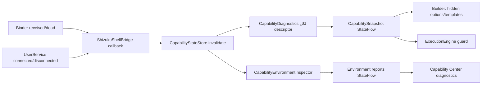

# NexaFlow v3.38.0 — تقرير واجهة القدرات الديناميكية

**الحالة:** جاهز للدمج والإصدار بعد اجتياز بوابة الاختبار الموثقة في نهاية التقرير.

## الهدف المنفذ

جعلت هذه النسخة **محرك القدرات القائم** المصدر الوحيد لحالة التنفيذ التي تستعملها واجهة المنشئ ومركز القدرات وحارس تشغيل workflow. لا تُعرض الإجراءات أو المحفزات غير القابلة للقبول؛ ولا تعني حالة وجود Root أو Shizuku وحدها أن عملية عامة قابلة للتنفيذ. يبقى كل من Android/ROM compatibility وقيود OEM طبقة مستقلة، ويُلزم الخيار بالمرور عبر الطبقتين معاً.

> لا تضيف هذه النسخة عملية ADB داخل التطبيق، أو Managed Google Play، أو silent install، أو وصولاً عاماً إلى shell. لا يظهر أي منها كقدرة تنفيذية.

## المعمارية: قبل وبعد

| المجال | قبل v3.38.0 | بعد v3.38.0 | الدليل التنفيذي |
| --- | --- | --- | --- |
| مصدر حالة capability | استعلامات backend منفصلة وsnapshot UI ثابت | `CapabilityStateStore` مفرد ينشر `CapabilitySnapshot` وdiagnostics عبر `StateFlow` | `core/execution/.../CapabilityStateStore.kt` |
| Shizuku | binder/UserService موجودان، لكن لا ينعكس التغير تلقائياً على الواجهة | callbacks لوصول/موت binder واتصال/فقدان UserService تطلق invalidation حدثياً | `ShizukuShellBridge.kt` و`CapabilityStateStore.kt` |
| Root | وجود binary ثابت قد يُفسر بصورة إيجابية | لا يعلن Root متاحاً إلا بعد إثبات استجابة `su` بـ`uid=0` | `SystemAppStatusDetector.probeRoot()` |
| Actions وTriggers | `CompatibilityGate` يفحص compatibility فقط عند إنشاء composable | `CompatibilityGate` يدمج compatibility مع `CapabilityRequirementResolver` وsnapshot تفاعلي | `CompatibilityGate.kt` و`CommandRequirementCatalog.kt` |
| البحث والتصفح | يتبعان خيار compatibility السابق | يشتقان من `supportedActions` و`supportedTriggers` المفلترين نفسيهما | `AutomationBuilderScreen.kt` و`AutomationOptionCatalog.kt` |
| القوالب | يمكن تطبيق templateId من الكتالوج دون capability snapshot | لا يُطبّق القالب إلا عند نجاح متطلبات كل Action وTrigger في snapshot الحالي | `RoutineTemplate.kt` و`AutomationBuilderScreen.kt` |
| مركز القدرات | شاشة ROM-centric، snapshot ثابت، تتضمن grant/install/write paths | شاشة diagnostics فقط، تراقب state flows، وتعرض البيئات والقدرات غير المتاحة وسبباً مترجماً | `CapabilityCenterScreen.kt` و`CapabilityCenterViewModel.kt` |
| Workflow run | يمكن أن يصل handler قديم إلى التنفيذ دون حارس snapshot عام | `WorkflowCapabilityValidator` يمنع التشغيل قبل controller/checkpoint/side effect | `WorkflowCapabilityValidator.kt` و`ExecutionEngine.kt` |
| Workflow enable | save يفترض enable السابق/الافتراضي | المهمة غير المقبولة تحفظ **معطلة** ولا تُحذف | `AutomationBuilderViewModel.kt` |

## مصفوفة المكونات والحالة

| المكوّن | الحالة | ما الذي يثبته | حدود مقصودة |
| --- | --- | --- | --- |
| `CapabilityRequirement` وresolver | مكتمل ومختبر | `None` و`Capability` و`AllOf` و`AnyOf` و`Not` تقرر القبول حتمياً؛ `PARTIAL` لا يُقبل | النموذج لا يعرف Android أو Root أو Shizuku |
| `CapabilityEnvironmentInspector` | مكتمل ومختبر | يميّز Shizuku: غير مثبت/غير مشغّل/إذن مطلوب/UserService غير متاح/متاح؛ وRoot: binary موجود مقابل uid=0 مثبت | Device Owner تشخيص provisioning فقط، لا يمنح Action |
| `CapabilityStateStore` | مكتمل ومختبر | cache موحد، `Mutex` ضد refresh المتوازي، وinvalidation من callback Shizuku | لا يوجد polling دوري |
| `CommandRequirementCatalog` | مكتمل ومختبر | `SYSTEM_OPEN_URL` و`SYSTEM_OPEN_SETTINGS` فقط مرتبطان بbackends public مسجلة؛ shell/elevated/bridge غير المربوط يرفض | لا يحوّل `IntegrationLevel` إلى entitlement عام |
| تحديث Google Play | محجوب صراحة | action legacy لا يُقبل ولا يظهر كمهمة تحديث تلقائي | لا يوجد backend typed رسمي/موثق يثبت اكتمال تحديث التطبيقات |
| القوالب | مكتمل | template يمر فقط إن كانت كل triggers/actions مقبولة | القوالب غير المتاحة لا تحذف من الكتالوج أو البيانات |
| مركز القدرات | مكتمل | قراءة فقط، 20 نصاً جديداً مترجماً في 11 locale | لا يعرض زر grant ولا ينفذ shell أو install |
| validator | مكتمل ومختبر | يفحص triggers وactions وexitActions قبل التشغيل؛ حفظ workflow غير مقبول يكون disabled | المهام المستوردة تبقى محفوظة ويمنع تشغيلها فقط |
| ADB | غير مدعوم عمداً | يعرض `ADB_NOT_EXPOSED_TO_NORMAL_APP` في diagnostics | لا backend مسجل للإنتاج |
| Device Owner / Managed Google Play | تشخيص فقط / غير مدعوم كتنفيذ | `isDeviceOwnerApp` يوضح حالة الجهاز المدارة | لا provisioning ولا managed-play backend typed |

## مسار حالة Shizuku

## سلوك الإخفاء والمنع

| السيناريو | النتيجة |
| --- | --- |
| Shizuku binder يموت أو UserService ينفصل | يتغير snapshot عبر callback؛ Actions/Triggers المعتمدة على backend typed لا تعرض إذا لم تعد قابلة للتنفيذ |
| `su` binary موجود، لكن grant مرفوض أو لا يجيب uid=0 | Root لا يصبح AVAILABLE؛ السبب المعروض هو permission required أو not installed بحسب الدليل |
| Action legacy يستخدم `ELEVATED` أو `SHELL` بلا backend typed موصول | لا يعرض ولا يمر validator؛ لا يوجد fallback عام إلى Root/Shizuku |
| Action يفتح URL | يظهر فقط إذا كان intent backend يحل HTTPS handoff فعلياً |
| Google Play automatic update | مخفي وغير مقبول؛ لا يتحول فتح/تحديث Play إلى ادعاء تنفيذ تلقائي |
| Automation مستورد يحتوي requirement غير مقبول | لا يُحذف؛ حارس التشغيل يسجل `CAPABILITY_BLOCKED` قبل أي side effect |
| Automation محرر حالياً يصبح غير مقبول | يحفظ مع `enabled=false`، ومركز القدرات يشرح الحالة |

## الترجمة

أضيف مورد `capability_diagnostics.xml` في locales التالية: `en`, `ar`, `de`, `es`, `fr`, `hi`, `ja`, `pt`, `ru`, `tr`, و`zh-rCN`. يغطي المورد أسماء بيئات التنفيذ، حالات البيئة المعرّفة، حالات عدم توفر capability، وعدّاد/سبب diagnostics.

## بوابة التحقق المنفذة

| الأمر | النتيجة |
| --- | --- |
| `git diff --check` | ناجح |
| `python3 scripts/auto_fix.py --check` | ناجح بعد إزالة الموارد اليتيمة من الشاشة القديمة |
| `:domain:testDebugUnitTest` | ناجح |
| `:core:execution:testDebugUnitTest` | ناجح |
| `:feature:automation-builder:testDebugUnitTest` | ناجح |
| `:core:capability-manager:compileDebugKotlin` | ناجح |
| `:app:compileDebugKotlin` | ناجح |

## اختبارات مضافة أو مصححة

| الاختبار | الإثبات |
| --- | --- |
| `CapabilityRequirementResolverTest` | AllOf/AnyOf/Not وحظر PARTIAL |
| `CapabilityEnvironmentInspectorTest` | ترتيب حالات Shizuku وRoot وDevice Owner وADB |
| `CapabilityStateStoreTest` | snapshot أولي وrefresh حدثي ينشران حالة backend جديدة |
| `CommandRequirementCatalogTest` | URL public-backed، حظر elevated غير المربوط، وحظر Play update |
| `WorkflowCapabilityValidatorTest` | القبول عند توفر requirement، المنع عند الغياب، ومنع action elevated غير المربوط |

## القرار

لا توجد حاجة إلى phase معمارية موازية. التوسعة بقيت فوق `CapabilityRegistry` و`CapabilityDiagnostics` و`CompatibilityGate` و`ExecutionEngine` القائمة. أي Action مستقبلي يريد الظهور يحتاج أولاً backend typed مسجلاً، وrequest mapper semantics-preserving عند الحاجة، وrequirement في `CommandRequirementCatalog`، واختبارات تثبت حالة availability والتنفيذ؛ خلاف ذلك يبقى مخفياً.
